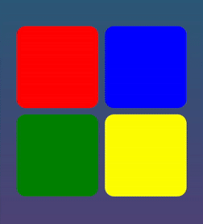

# 🎵 Echo Runner

Echo Runner is a simple yet addictive memory game inspired by the classic **"Simon Says"** concept.  
Repeat the sequence of lights and sounds as they get faster and longer with each level.  
Perfect for testing your memory and focus while having fun!

---

## ✨ Features
- 🖱 **Interactive Gameplay** – Click colored buttons following the sequence.
- 🎶 **Synchronized Sounds** – Each color has its own tone.
- 🚀 **Progressive Difficulty** – The sequence grows each round.
- 🔁 **Restart Option** – Easily restart after Game Over.
- 💻 **Desktop Ready** – Can be packaged into an EXE for Windows.

---

## 🛠 Technologies Used
- **Java 21+**
- **JavaFX** (UI & Animations)
- **Maven** (Build tool)
- **Launch4J** or `jpackage` (for EXE packaging)

---

## 🖼 Game Preview


## 🚀 How to Run Locally
1. Clone the repository:
   ```bash
   git clone https://github.com/FuadValiyev/EchoRunner.git
   cd EchoRunner
2. Run using Maven:
   ```bash
   mvn clean javafx:run
3. Or build the JAR:
   ```bash
   mvn clean package
   java -jar target/demo-1.0.jar
